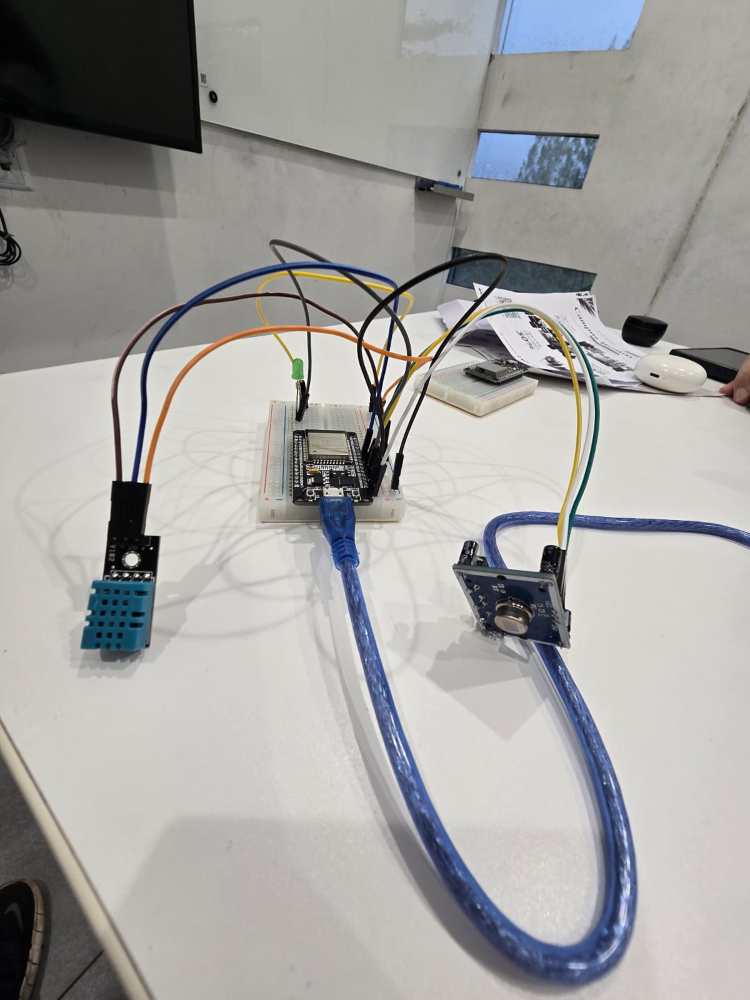
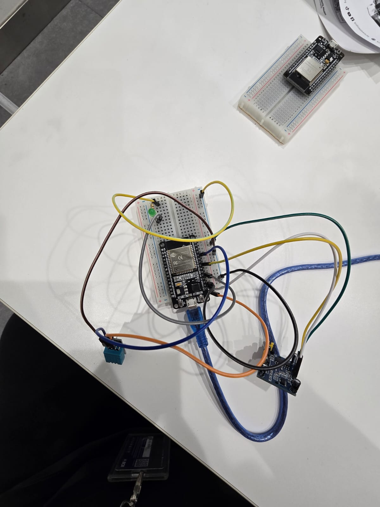
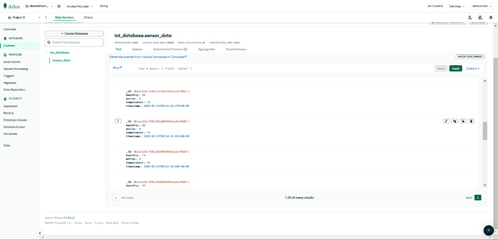
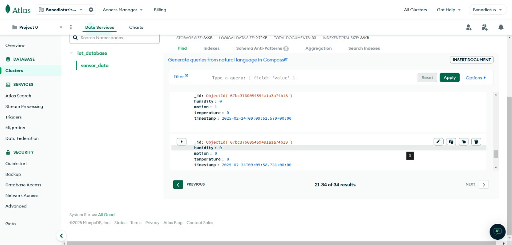
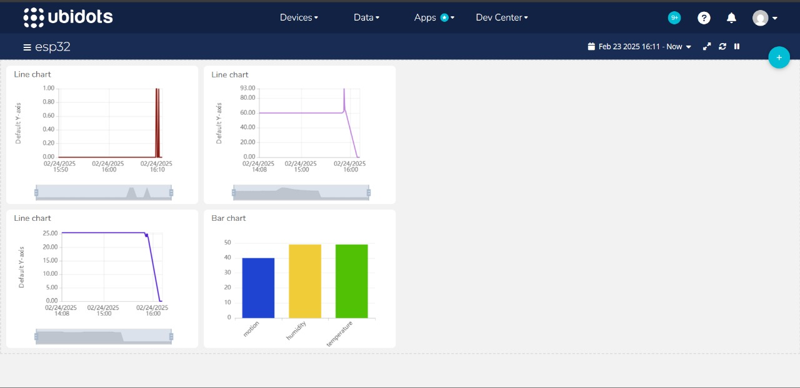
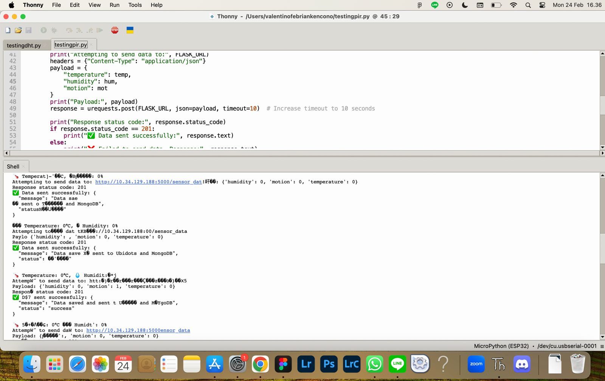
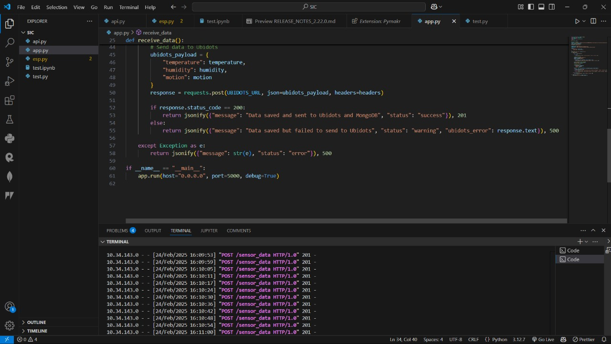

# SIC 6 - Rasus Yesus - Assignment 2 - Stage 2

This repository contains the documentation of Rasus Yesus's SIC 6 Assignment 2 Stage 2 🔥🔥

## Table of Contents

1. [Mockup Screenshot](#mockup-screenshot)
2. [Technology and Infrastructure](#technology-and-infrastructure)
3. [Owner](#owner)

## Mockup Screenshot

- Devices - Physical Visualization of Our Component

  

  

- MongoDB - POST Data

  

  

- Ubidots - Visualize our Data in Ubidots Widgets

  

- Results - Successful Data Fetching and Sending

  

  

## Technology and Infrastructure

This project is built using modern IoT tools and programming language:

- **Visualization**: Ubidots (displaying fetched data and visualized with charts)
- **Programming Language**: Python (used with Thonny IDE for development)
- **Database**: MongoDB (used to store sensor data)
- **API Testing Tool**: Postman (used for testing the API endpoints)

## Owner

This Repository is created by:

- 2702211185 - Christopher Hardy Gunawan
- 2702265351 - Valentino Febrian Kencono
- 2702230045 - Alfred Dexter
- 2702223941 - Benedictus Jason
